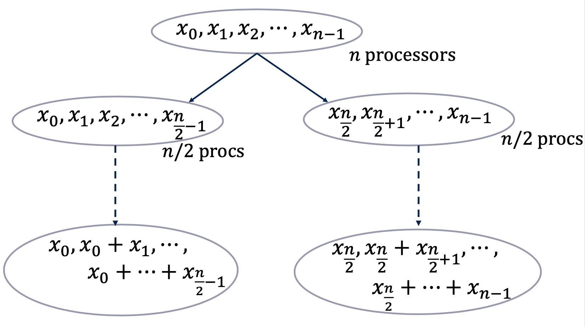

# 并行归约（reduction）与前缀归约（prefix reduction）

[上文](https://zhuanlan.zhihu.com/p/459273132)我们介绍了并行算法设计的基本复杂度分析以及设计原则，本文我们以归约和前缀归约为主要例子来继续研究并行算法的基本设计思想。前缀归约虽然看似是一个简单的问题，但是它实际上是很多更复杂、更实际的问题的本质，即我们能用它来解决很多更大的问题。

## 计算模型与网络拓扑结构

我们在讨论并行算法的时候需要假定一个计算（机器）模型，就像我们讨论串行算法会假定RAM模型一样。对于并行算法设计，一个常见的并行模型是PRAM，即Parallel RAM，它假定所有的处理器都能直接访问一个全局的内存，甚至不同的处理器还能进行并行的读或者写。另一种计算模型是分布式的，即每个处理器有自己local的内存，然后大家通过网络连接在一起。当然还有很多其他的模型，这里暂且不做详细介绍。本文的讨论中我们会使用分布式内存的模型。


对于分布式内存的计算模型，既然处理器是通过网络连接在一起，那拓扑结构就很重要了。我们看三种常见的拓扑结构：

### Bus（总线）

即所有的处理器通过一个bus连在一起，每次bus上只能有一次通信。总线是最简单的模型，在计算机中很常见，但是他的问题在于不scalable，而且也没有并行性，每次只能一个人用。

### All connected（全连接）

那我们把所有的处理器都连一起呢？那不是可以现实所有的pair都能同时通信了吗？但是这里的问题是把所有的处理器都连接在一起，需要的线太多了。譬如，假如有p个处理器，则需要$p(p-1)/2$条链接。譬如假如我们有1000个处理器，那总的链接数就100万了，还是太多了。

### Hypercube（超方形）

超方形就是正方形和立方体的多维扩展，譬如2维的超方形就是一个正方形，而三维的超方形就是立方体。下图演示了1到4维的超方形：


超方形的链接可以这样表示：

当我们用二进制数来表示每一个节点的时候，那么对于bit j，如果两个节点只有一个bit不同，那他们之间就存在链接。譬如假如一共有8个节点，我们会得到如下的链接（十进制表示）：


这个模式有没有看着很熟悉，没错，**超方形本质上表达的是像FFT一样的蝶形网络**，这也正是为什么超方形需要的链接数是$p\log p/2$。本文的讨论中我们假定网络的连接方式是超方形。

下图是几种常见的拓扑结构的一些性质（cost就是链接数）：


## 并行求和

求和的问题定义就是计算$n$个数的和。假设我们用$p$个处理器（假设$p$能整除$n$），我们可以这样来求和：

每个处理器被分配$n/p$个数，然后先在本地完成这些数的求和，这时问题便变成了用$p$个处理器对$p$个数进行求和。在超方形的拓扑结构下，只需要$\log p$次通信就能完成求和，如下图所示。


于是这里的并行时间就是（其中$\tau$代表发送一个数字需要的通信时间相对本地的计算时间的比值）：

$T(n, p) = O(n/p + \tau \log p)$ 

# 并行前缀和（Parallel Prefix Sum）

前缀和的问题定义如下：

给定一串数 $x_0, x_1, \dots x_{n-1}$，求 $S_0, S_1, \dots, S_{n-1}$，其中$S$的定义如下：

$S_i = \sum_{j=0}^{i} x_j$.

即

```
S0 = x0
S1 = x0 + x1
S2 = x0 + x1 + x2
...
```

可以看出 $S_{i} = S_{i-1} + x_i$。于是用一个串行的程序计算的复杂度是$\Theta(n)$，其伪代码如下：

```python
S[0] = x[0]
for i in range(1, n):
  S[i] = S[i-1] + x[i]
```

> 注：这里是一个inclusive的定义，也有exclusive的版本，两者都有很多应用。

这个代码咋一看有一个依赖，所以看起来没法并行化，但是由于加法具有结合律，我们可以通过非常巧妙的方式将这个计算（高效地）并行起来。

这里我们采用分治法的思路，将原序列对半切，如下所示。然后对于前一半和后一半分别计算他们的前缀和。当他们分别完成自己的计算以后，我们只需要把前一半的总和 $S_{n/2-1}$ 发送给后一半的所有处理单元，让他们把自己的local sum加上这个前一半的总和，就能得到正确的前缀和，如下图所示。




但是这里的问题是，只有一个处理器有$S_{n/2-1}$这个数，于是它需要广播给后一半的所有处理单元，这里就涉及到一个广播操作，其时间复杂度是$O(\log p)$。这里显然就是一个瓶颈了，那怎么让这个步骤更快呢？一个很巧妙的方法就是让前面一半的处理器人人都有$S_{n/2-1}$这个结果，这样发给后一半的所有处理器的时候就能并行地发，就能一步到位了。

以8个数+8个处理器为例，我们可以设计一个并行算法，其计算过程如下：

首先8个处理器分别拿到0-7这8个数，然后最终正确的结果应该是

```
P0: 0
P1: 0 + 1
P2: 0 + 1 + 2
P3: 0 + 1 + 2 + 3
...
```

我们现在看怎么并行地算出来。当前n=2的分组如下（4组）：

```
P0 | P1
P2 | P3
P4 | P5
P6 | P7
```

我们用如下的方式表示第一轮通信

```
P0 -> (0) P1  # P0发送0给P1
P2 -> (2) P3  # P2发送2给P3
P4 -> (4) P5
P6 -> (6) P7
```

与此同时高rank的处理器也向低rank的处理器发

```
P1 -> (1) P0  
P3 -> (3) P2 
P5 -> (5) P3
P7 -> (7) P6
```

我们来看看现在8个处理器大家的结果分别是啥样：

```
P0: 
prefix_sum: 0, total_sum: 0+1=1
P1:
prefix_sum: 1+0=1, total_sum: 1+0=1
P2: 
prefix_sum: 2, total_sum: 2+3=5
P3: 
prefix_sum: 3+2=5, total_sum: 3+2=5
P4: 
prefix_sum: 4, total_sum: 4+5=9
P5: 
prefix_sum: 5+4=9, total_sum: 5+4=9
P6: 
prefix_sum: 6, total_sum: 6+7=13
P7:
prefix_sum: 7+6=13, total_sum: 7+6=13
```

这里每个处理器需要两个variable，一个保存自己的结果（prefix_sum)，一个保存用来广播的结果（total_sum）（为了加速）。这里就需要一个逻辑就是：

对于total_sum，我们直接把收到的数加上去。但是对于prefix_sum，我们只有收到rank更低的处理器发来的数的时候才加上去，于是最终的prefix_sum就是对的。

根据上面分治法的思路，我们现在需要把$S_{n/2-1}$这个结果发给后一半的处理单元，当前n=4，于是我们分组一下是这样：

```
P0 P1 | P2 P3
P4 P5 | P6 P7
```

于是低位的处理器把他们的结果发给高位的：

```
P0 -> (1) P2
P1 -> (1) P3
P4 -> (9) P6
P5 -> (9) P7
```

与此同时，高位的处理器也把他们的结果发给低位的：

```
P2 -> (5) P0
P3 -> (5) P1
P6 -> (13) P4
P7 -> (13) P5
```

现在8个处理器大家的结果分别是啥样：

```
P0: 
prefix_sum: 0, total_sum: 1+5=6
P1:
prefix_sum: 1+0=1, total_sum: 1+5=6
P2: 
prefix_sum: 2+1=3, total_sum: 5+1=6
P3: 
prefix_sum: 5+1=6, total_sum: 5+1=6
P4: 
prefix_sum: 4, total_sum: 9+13=22
P5: 
prefix_sum: 5+4=9, total_sum: 9+13=22
P6: 
prefix_sum: 6+9=15, total_sum: 13+9=22
P7:
prefix_sum: 13+9=22, total_sum: 13+9=22
```

现在n=4，还有第三轮，分组如下：

```
P0 P1 P2 P3 | P4 P5 P6 P7
```

即P4 P5 P6 P7需要加上前面四个的total_sum，即P0、P1、P2、P3要把6发给P4 P5 P6 P7等。

```
P0: 
prefix_sum: 0, total_sum: 6+22=28
P1:
prefix_sum: 1+0=1, total_sum: 6+22=28
P2: 
prefix_sum: 2+1=3, total_sum: 6+22=28
P3: 
prefix_sum: 5+1=6, total_sum: 6+22=28
P4: 
prefix_sum: 4+6=10, total_sum: 22+6=28
P5: 
prefix_sum: 9+6=15, total_sum: 22+6=28
P6: 
prefix_sum: 15+6=21, total_sum: 22+6=28
P7:
prefix_sum: 22+6=28, total_sum: 22+6=28
```

这里我们可以看到算出最后的结果一共是$O(\log n)$步，recurrence是：
$$
T(n, n) = T(n/2, n/2) + \Theta(1) + \Theta(\tau)
$$
其中$\Theta(1)$是本地的计算时间，$\Theta(\tau)$代表发送一个数的通信时间。这个过程的伪代码如下：

```python
prefix_sum = local_number
total_sum = local_number
rank = get_rank()
for i = 0 to d-1 do
	rank1 = rank XOR 2^i
  send total_sum to rank1
  receive received_sum from rank 1
  total_sum += received_sum
  if (rank1 < rank) 
  	prefix_sum += received_sum
endfor
```

那如果只有p个处理器呢？我们可以采用类似并行求和的策略，先进行本地计算，本地算完了以后，问题就变成了一个size为p的前缀和问题。但是这里有一个问题就是，如果本地要算多个数的前缀和，那这个问题就得表述成exclusive的形式，不然就会导致本地的数的前缀和不对（把自己的给加上了），这个过程的描述如下：

- 把n个数按块分配给p个处理器
- 每个处理器P有三个变量，local_prefix_sum，prefix_sum和total_sum，其中local_prefix_sum是数组，保存本地的prefix sum结果。prefix_sum和total_sum用来做size为p的前缀和问题的求解
- 调用一个size为p的前缀和问题，使用prefix_sum和total_sum
- 把prefix_sum加到local_prefix_sum的每一项中

对应的伪代码如下：

```python
prefix_sum = 0
total_sum = local_sum
rank = get_rank()
for i = 0 to d-1 do
	rank1 = rank XOR 2^i
  send total_sum to rank1
  receive received_sum from rank 1
  total_sum += received_sum
  if (rank1 < rank) 
  	prefix_sum += received_sum
endfor

add prefix_sum to each element in local_prefix_sum
```

这个过程在计算上花的时间是$\Theta(n/p+\log p)$，在通信上花的时间是$\Theta(\tau \log p)$。

## 拓展

这个算法的框架适用于任何prefix reduction的问题，只要操作符是满足结合律的，譬如加法、矩阵乘法等。之后有机会再讨论它的应用，即用它来求解更复杂的问题。

文中图片来自: https://faculty.cc.gatech.edu/~saluru/


Parallel prefix 


Why log p in computation?


https://www.youtube.com/watch?v=We9j876CjtA&list=PLAwxTw4SYaPnFKojVQrmyOGFCqHTxfdv2&index=129&ab_channel=Udacity


https://www.youtube.com/watch?v=PMeGxYRaJDU&list=PLAwxTw4SYaPnFKojVQrmyOGFCqHTxfdv2&index=148&ab_channel=Udacity


